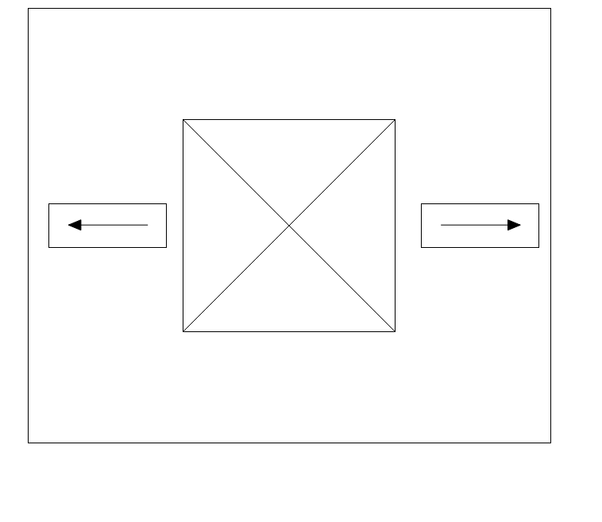

# Reto de Carrusel Básico con HTML, CSS y JavaScript

Este proyecto consiste en resolver un reto de desarrollo web en el que se debe crear un carrusel básico utilizando HTML, CSS y JavaScript. El objetivo principal es crear un componente funcional que permita a los usuarios navegar entre tres imágenes predeterminadas.

**Nota:** Para este ejercicio **no** está permitido el uso de frameworks de CSS

## Contexto

El reto de HTML, CSS y JavaScript consiste en crear un carrusel de imágenes sencillo que permita mostrar tres imágenes, una a la vez, con la capacidad de navegar entre ellas usando flechas de navegación o puntos indicadores. Las imágenes necesarias para el carrusel se encuentran dentro de la carpeta `assets`.

## Requisitos

- Crear un carrusel básico que contenga tres imágenes predeterminadas.
- Incluir controles de navegación para avanzar o retroceder entre las imágenes.
  - Al llegar a un extremo del carrousel (es decir, estar en la foto 1 o la foto 3) se debe deshabilitar la flecha de navegación hacía el lado que no tenga más imágenes. Es decir, en la imagen 1 la flecha a la izquierda debe estar deshabilitada y en la imagen 3 la flecha a la derecha debe estar deshabilitada 
- Implementar una transición suave entre las imágenes.
- La página debe ser responsive y el carrusel debe verse bien en dispositivos móviles, tabletas y escritorio.

## Instrucciones de uso

1. Clonar este repositorio en tu máquina local.
2. Usar HTML y CSS para diseñar la estructura del carrusel y estilizarlo.
3. Utilizar JavaScript para implementar la funcionalidad de navegación entre las imágenes.
4. Asegurarse de que el carrusel sea responsive y funcione correctamente en diferentes tamaños de pantalla.

## Responsive Design

El objetivo de este taller es hacer que el carrusel que desarrolles se vea correctamente en los 4 viewports presentados a continuación:

| Viewport            | Dimensiones (ancho x alto) |
| ------------------- | -------------------------- |
| **Mobile Portrait** | 320px x 480px              |
| **Tablet Portrait** | 768px x 1024px             |
| **Desktop**         | +1024px                    |

## Rúbrica de evaluación

| Aspecto                     | Puntuación |
| --------------------------- | ---------- |
| Estructura del HTML          | 0.5        |
| Estilos CSS                 | 1.5        |
| Funcionalidad del JavaScript | 2.5        |
| Adaptabilidad del diseño    | 0.25        |
| Transiciones y animaciones    | 0.25        |
| Total                       | 5          |

## Recursos adicionales

- [Guía de HTML](https://www.w3schools.com/html/)
- [Guía de CSS](https://www.w3schools.com/css/)
- [Guía de JavaScript](https://www.w3schools.com/js/)
- [Guía de diseño web responsive](https://www.w3schools.com/html/html_responsive.asp)
